# `datagui`

Easy-to-use immediate-mode GUI with:

- Easy setup and built-in window creation
- 2D/3D scene rendering
- Plotting
- Automatic data editing via [`datapack`](https://github.com/zachlambert/datapack).

The primary use-case is for basic debug/dev tools where you want to quickly get setup with a GUI and data visualisation.

For example, my main use case is for developing robotics algorithms, which involves a mix of 3D rendering, data plotting and only basic GUI functionality.

## GUI features

### Basic usage

[`examples/gui/basic.cpp`](examples/gui/basic.cpp)

```c++
int main() {
  dgui::Gui gui;
  gui.open();

  while (gui.poll()) {
    gui.group();
    DGUI_SCOPE(gui);

    gui.text_box("Hello");
    if (gui.button("Click Me")) {
      std::cout << "Clicked" << std::endl;
    }
  }
  return 0;
}
```

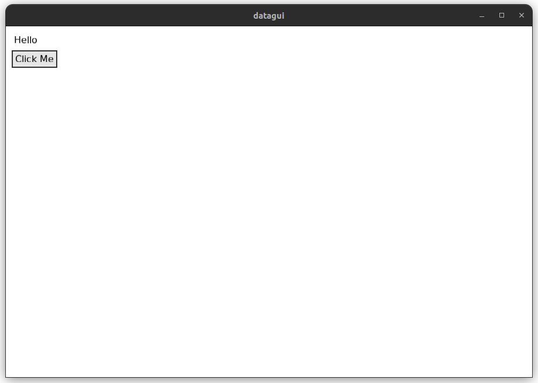

Note: `DGUI_SCOPE(gui)` expands to:

```c++
auto defer_end = gui.defer_end();
```

which creates a RAII object that calls `gui.end()` automatically at the end of the scope.<br>
May also choose to write this manually, or manually call `gui.end()` yourself - but this must be done for every container element.

### More examples

See [`examples/gui/`](examples/gui/) for code.

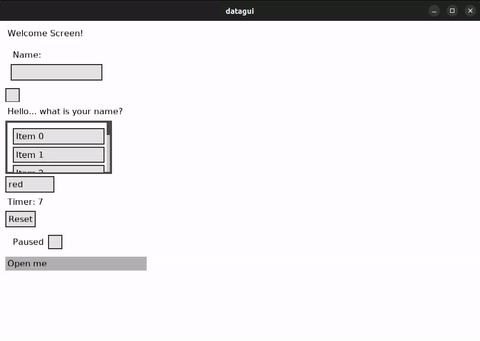
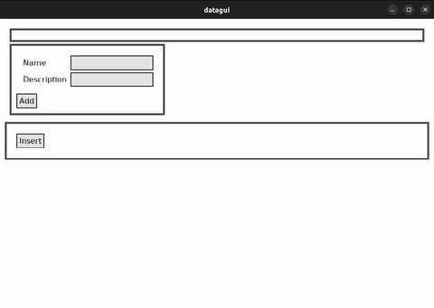

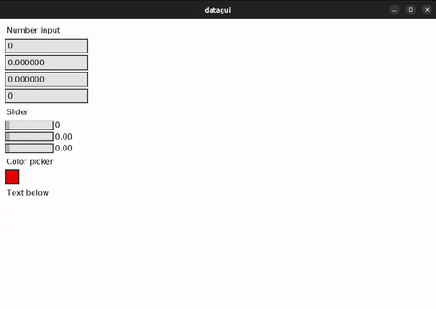
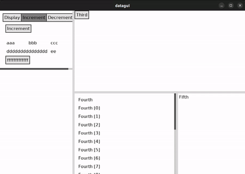

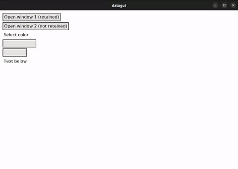

### Automatic datatype editing

Uses the [`datapack`](https://github.com/zachlambert/datapack) library, which provides a way for a type to declare its own data structure.

If a datatype already has the `datapack` functions defined, then you can create a block for editing/displaying the value with:

```c++
// gui.edit() stores the value internally, and returns a pointer to it on the
// frames where the GUI changed it (nullptr otherwise).
if (const MyStruct* value = gui.edit<MyStruct>("Label")) {
  // Has been modified
  std::cout << "New value: " << *value << std::endl;
}

// gui.edit_v() operates on your own value instead, so it can also be modified
// externally. Returns true on the frames where the GUI changed it.
MyStruct value;
if (gui.edit_v("Label", value)) {
  // Has been modified by the GUI
  std::cout << "New value: " << value << std::endl;
}

// Or if you don't care about checking when it's modified
gui.edit_v("Label", value);
```

[`examples/datapack/datapack_basic.cpp`](examples/datapack/datapack_basic.cpp)

<details>
<summary>Code</summary>

```c++
struct Point {
  double x;
  double y;
};
struct Circle {
  double x;
  double y;
  double r;
};

using Shape = std::variant<Point, Circle>;

namespace dpack {

DPACK_INLINE(Point, x, y)
DPACK_INLINE(Circle, x, y, r)

DPACK_LABELLED_VARIANT(Shape, 2);
DPACK_LABELLED_VARIANT_DEF(Shape) = {"Point", "Circle"};

} // namespace dpack

int main() {
  dgui::Gui gui;
  gui.open();

  while (gui.poll()) {
    gui.args().width_expand();
    gui.group();
    DGUI_SCOPE(gui);

    auto& points = gui.variable<std::vector<Point>>();
    gui.edit_v("Points", points);

    auto& shape = gui.variable<Shape>();
    gui.edit_v("Shape", shape);
  }
  return 0;
}
```

</details>

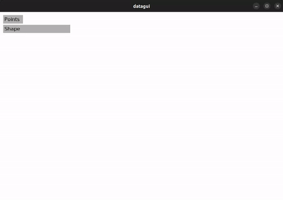

[`examples/datapack/datapack_complex.cpp`](examples/datapack/datapack_complex.cpp)
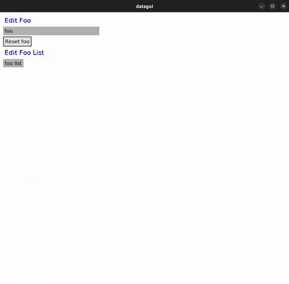

### Components

For convenience, may also define snippets of GUI code in classes to act as "components". These can then be easily instantiated in the GUI.

A component class is any class that has a method:

```c++
component.visit(gui, std::forward<Args>(args)...);
```

Since a component can have arbitrary arguments in the `visit` method, it's implemented as a c++20 concept rather than a base class.

[`examples/gui/component.cpp`](examples/gui/component.cpp)

```c++
int main() {
  dgui::Gui gui;
  gui.open();

  int number = 2;
  while (gui.poll()) {
    gui.group();
    DGUI_SCOPE(gui);

    gui.number_input_v(number);
    gui.component<NumberDisplay>(number);
  }
  return 0;
}
```

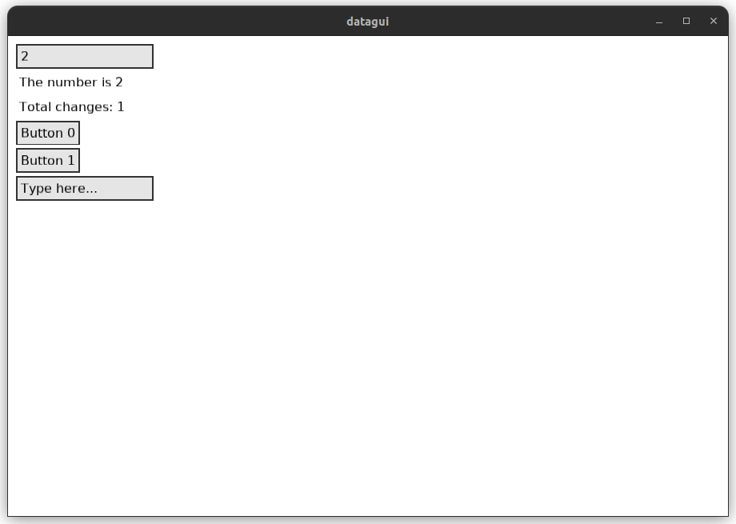

## 2D and 3D scenes

See [`examples/canvas/`](examples/canvas/) for code.

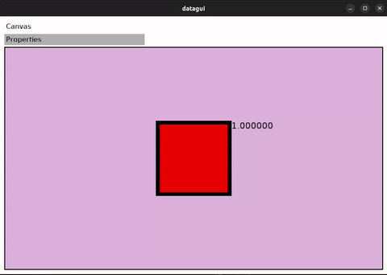

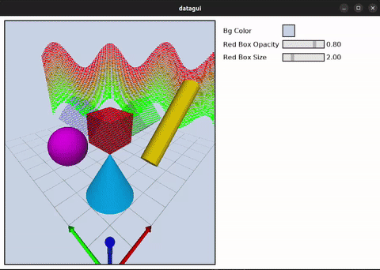

## Plotting

Currently, only line plots and heatmaps are implemented.<br>
(Note: These can go on the same plot, even though this isn't shown in the example)

See [`examples/plotter/`](examples/plotter/) for code.

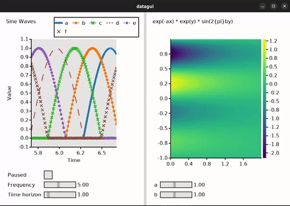

### One-off plotting

If all you want to render is a plot, this can be done with a single function call:

```c++
#include "datagui/plot.hpp"
#include <cmath>

int main() {
  std::vector<double> xs;
  std::vector<double> ys;
  for (int i = 0; i <= 1000; i++) {
    double x = double(i) / 500;
    xs.push_back(x);
    ys.push_back(std::exp(-x) * std::cos(10 * M_PI * x));
  }

  dgui::plot([&](dgui::Plotter& plotter) {
    plotter.xlabel("x");
    plotter.ylabel("y");
    plotter.plot(xs, ys);
  });
}
```

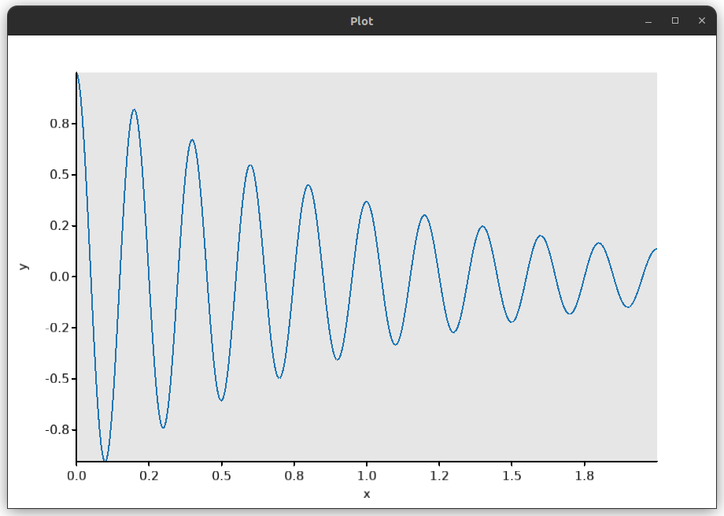
